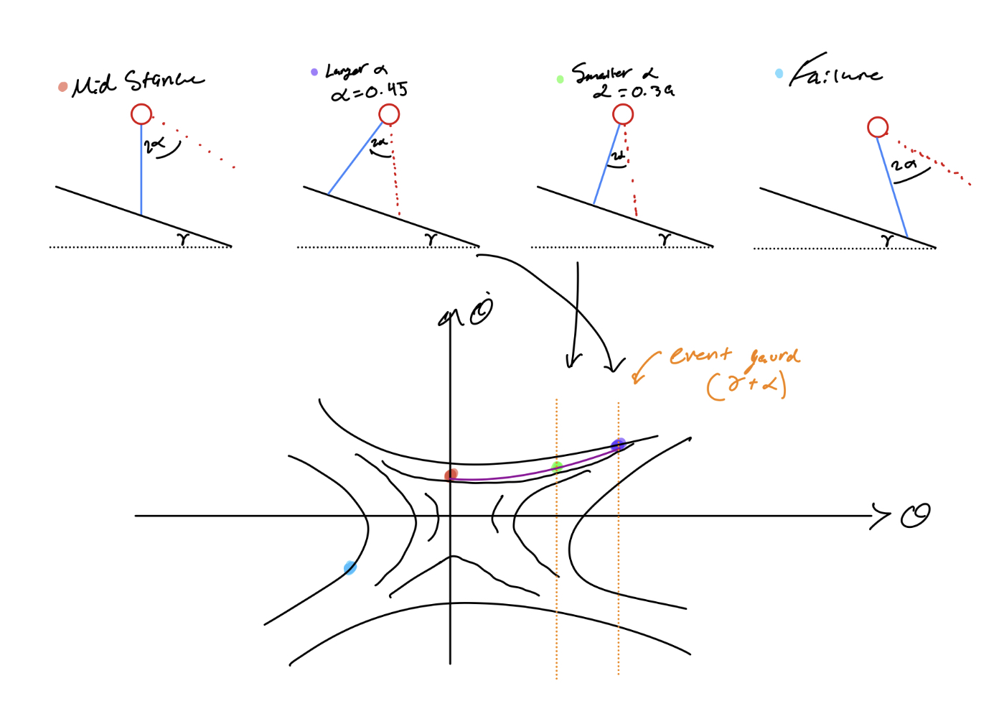

1. Your sketches

2. A visualization of the region of attraction for your ankle-controller

3. Explain your choice of Poincaré section

I chose:
$\Sigma = \{ (\theta, \dot{\theta}) : \theta = 0, \ \dot{\theta} > 0 \}$

I chose the section to be at the upright configuration where ${\theta = 0}$ because it creates a transverse line to the trajectory, if ${\dot{\theta} \neq 0}$ , while keeping the angle constant. ${\dot{\theta} > 0}$ corresponds to a forward crossing so each return is the same directional event. By keeping the angle constant, the angular velocity can describe the section alone. It is the physical point where the walker passes through the same physical posture on every step, and this section stays fixed when ${\alpha}$ changes, so returned values are comparable across varying ${\alpha}$. Comparable return values are important because they signify changes in system behavior rather than a result of a changing parameter.  

4. Explain how you verified your grid resolution, and show numbers to support your final decision (you should show numbers that show that a slightly lower resolution would not be good enough).

I verified the lookup-grid resolution by comparing grid resolution tables to a dense reference grid. I then checked the resulting policies on off-grid probe speeds. The validation criteria were: identical reachability, at least 95% agreement in executed step counts, maximum step error at most 1, and successful rollouts for all reachable probes. The results were:

- 9x3: exact prediction fraction = 0.8361, passed = 0
- 13x3: reachability agreement = 0.8525, max error = $\infty$, passed = 0
- 25x5: exact prediction fraction = 0.9508, passed = 1
- 51x9: exact prediction fraction = 0.9672, passed = 1
- 101x17: exact prediction fraction = 0.9836, passed = 1
- 201x33 and above: exact prediction fraction = 1.0000, passed = 1

The coarsest grid that passes the validation test is 25x5. A lower resolution such as 13x3 is not good enough because it fails the reachability test since it gives an infinite maximum step error; thus, it can misclassify valid trajectories. 

5. Plot the trajectory for an initial condition that requires at least 3 steps. For this initial condition, find and plot also the maximum number of steps the walker can continue walking before reaching the RoA.

6. A visualization of how many steps it takes to reach standstill for a given initial condition.
