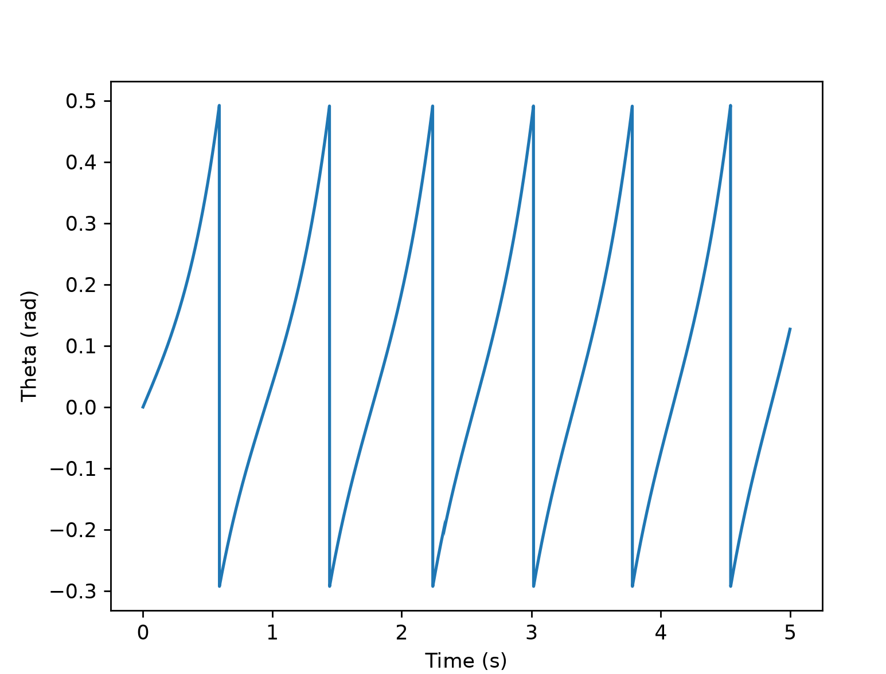
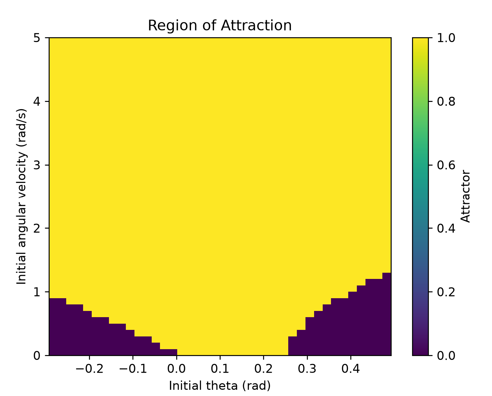
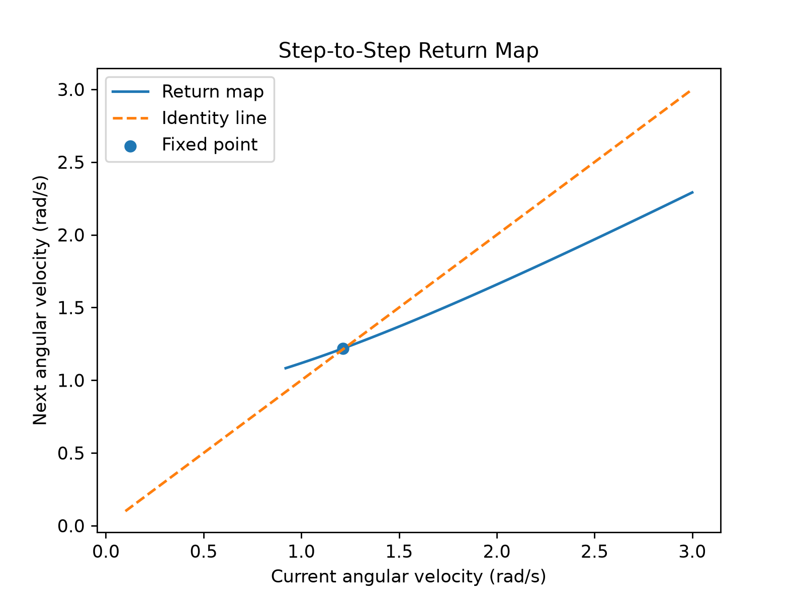
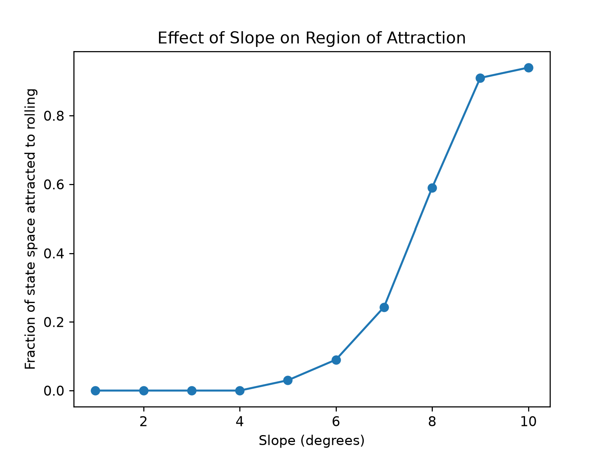
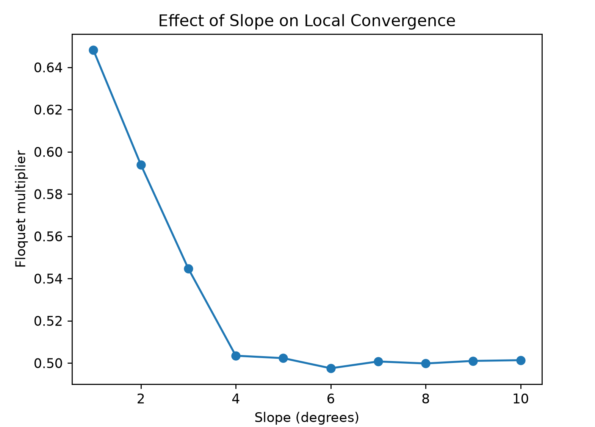
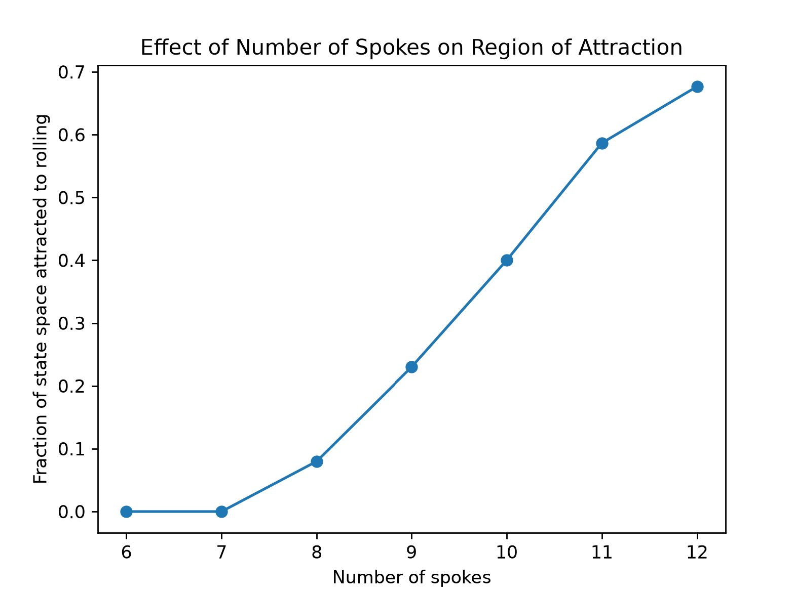
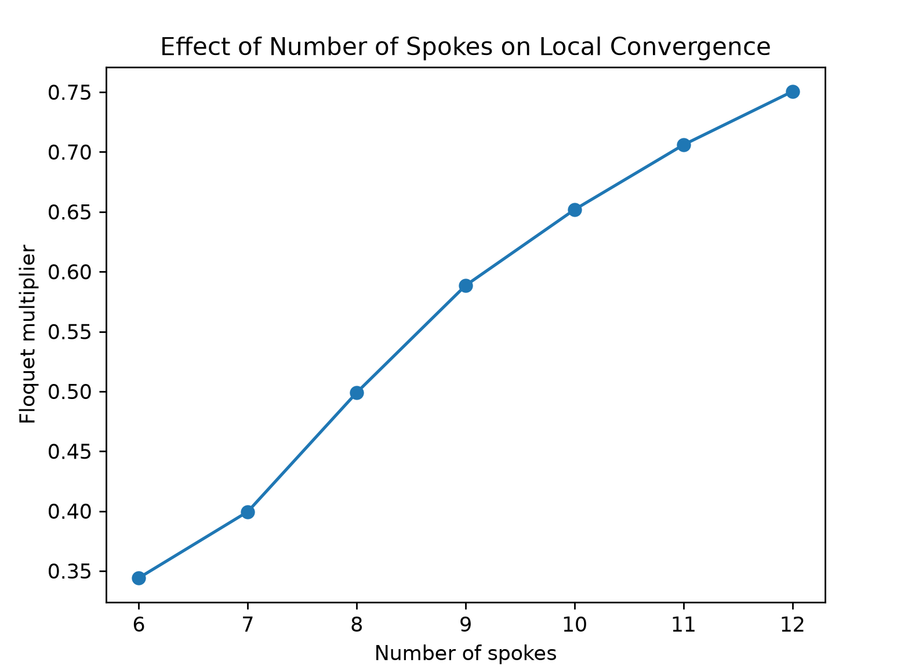

1. An explanation of your sanity checks, including what you expected and what happened; (5 pts)

    One of my sanity checks was to test the dynamics by creating a theta over time graph. This graph gives great physical inuitiion. You should see a steep slope at the start, and when the center of mass reaches over the middle of the spoke it should be slowest with the shallowest theta at the center, and then an increase in slope by the end of the cycle. Once the new spoke hits, theta should reset and restart the pattern.  
    After implimentiing the sanity check, the graph looks exactly like expected. 
    
    

    
    Another sanity check was to test if the impact occurs at the correct spoke angle.
    
    "impact_angle = params["slope_angle"] + np.pi / params["number_spokes"]
    
    state = np.array([impact_angle, 1.0])
    
    assert model.detect_event(state, params)
    
    print("Impact event detected correctly")"

    Since an event should be detected at the specified impact angle, the script should print "Impact event detected correctly." After implimenting it worked as intended. 

2. A state-space plot showing the RoA of every stable attractor, including fixed points and limit cycles; (5 pts)

3. Your one-dimensional return-map plot, with its fixed point and the identity line clearly marked; and (5 pts)

4. Visualization and discussion of how the slope and number of spokes affects the RoA and local convergence (10 pts)

Visualization of how slope affects RoA and local convergence:

Discussion:
The steeper the slope, the more energy the wheel will have to compensate for the energy lost during collisions. That is why the fraction of state space attracted to rolling increases as the slope increases. The graph resembles logarithmic growth. 

The Floquet multiplier measures local convergence to the rolling limit cycle. A smaller magnitude of the Floquet multiplier means that perturbations decay more quickly from step to step. As the slope increased, the magnitude of the Floquet multiplier decreased, indicating that the rolling cycle became more locally stable.

Visualization of how number of spokes affects RoA and local convergence:

Discussion:
The more spokes, the less energy the wheel will lose during collisions. That is why the fraction of state space attracted to rolling increases as the number of spokes increases. Again, the graph resembles logarithmic growth. 

The Floquet multiplier measures local convergence to the rolling limit cycle. A smaller magnitude of the Floquet multiplier means that perturbations decay more quickly from step to step. As the number of spokes increased, the magnitude of the Floquet multiplier increased, indicating that the rolling cycle became less locally stable.
